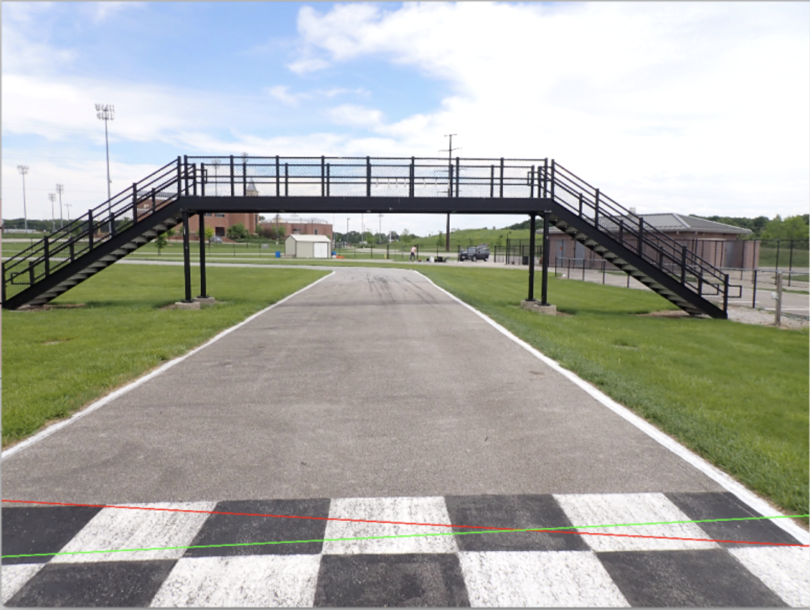
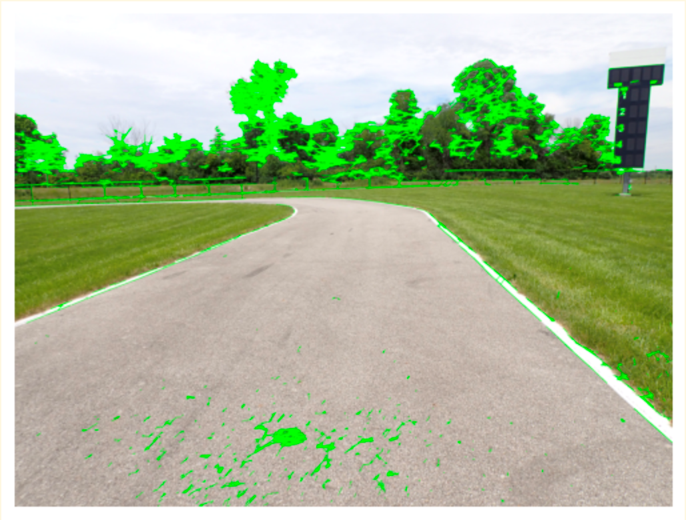
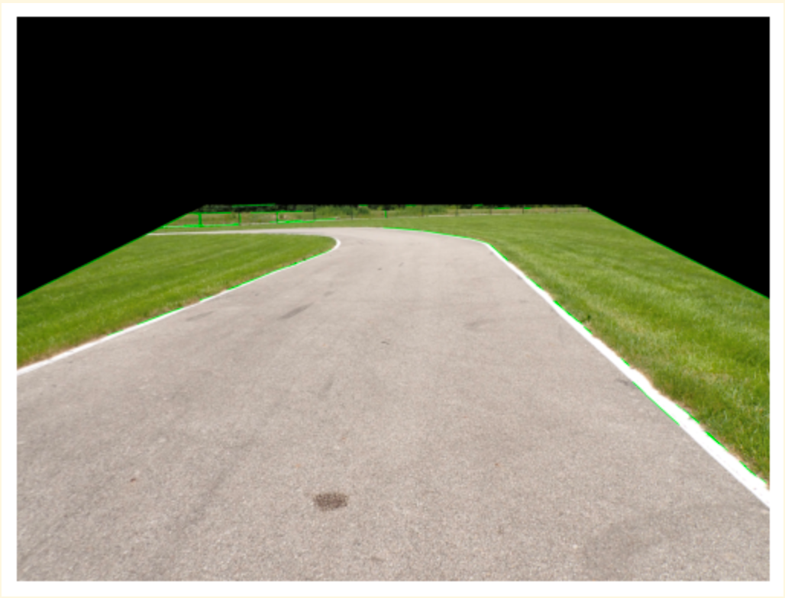
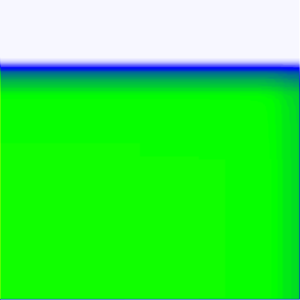

# UCSD HDSI - DSC 190 Winter 2024, Team #2

## Deliverables

### Must Have
1. Model working on a pre-recorded video ✅

### Nice to Have
1. Model working on a Jetson AGX ❌
2. Model working on an Oak-D camera ❌

### Media

**Click the thumbanails to watch on YouTube**

Original Video (1920x1080p, 30 FPS):

[](https://www.youtube.com/watch?v=74YdnvhRzvM)

Output Video 1 (Using 640x400p pre-processing, -15% and +15% brightness augmentations in training data):

[](https://youtu.be/jzMz9ItQHFY)

Output Video 2 (Using -15% and +15% brightness augmentations in training data) <-- OUR BEST MODEL:

[](https://youtu.be/DIbjZlLFfbU)

## What We Did

During this quarter, we learned how to use an Oak-D camera, tinkered with computer vision techniques using OpenCV, collected training data, learned how to use Roboflow, annotated 2000+ images for our semantic segmentation model, trained a total of 11 models, and learned how to execute Docker containers within a Linux environment.

### Failed Attempts

#### OpenCV

Most of our failed attempts were from trying to use past repos that did lane detection. Most of these models used OpenCV methods which were interesting to read about, but took a lot of effort to tweak as most of the code available online were outdated, and/or had a lot of parameters that we did not know how to adjust.

Something that we overlooked was that our model needed to differentiate between road and grass instead of lane and road. Most models online differentiated between lane and road instead of road and grass so that was another reason why we we were unable to find a repository that worked. 

Below are the OpenCV techniques that we tried and their results:

**Proba_Hough1**: This script demonstrates a basic pipeline combining Edge Detection (Canny) and line detection (Probabilistic Hough Transform) techniques for lane detection in images.

1. Convert uploaded Image to RGB

2. Define Region of Interest - polygonal region where lanes are expected to appear

3. Convert cropped Image to Grayscale

5. Detect Lines Using Probabilistic Hough Transform - detect lines in the cropped image (this technique is used to identify straight lines in the image)

6. Draw Lines on Image and Display

Testing on Purdue Track:


We experimented with various combinations of parameters for tuning the algorithm, but none significantly improved its performance. The algorithm appears to identify cracks on the lane rather than lane edges.
1. The Canny edge detection algorithm is tailored for detecting road edges, edges between road and grass may not exhibit the same level of contrast
2. The region of interest defined here may not be suitable for Purdue track images.

**Proba_Hough2**: The script implements a lane detection algorithm using Fourier Transform and Hough Transform techniques. Additionally, it addresses challenges such as color and exposure issues in input frames by employing a weighted average approach for curve fitting parameters.

1. Gaussian Filter and Mask Generation -  creates a circular mask centered on the image by generating a 2D Gaussian filter kernel to focus processing on the area of interest

2. Convert input image to grayscale

3. Apply a threshold to create a binary image, highlighting regions of interest

4. Apply Gaussian blur to the binary image to reduce noise and smoothen ed

5. Perform Fourier Transform - to transform it into the frequency domain

6. Applied Hough Transform (cv2.HoughLinesP) - to detect line segments in the transformed image

7. Draw fitted lines on the input frame - detected line segments are categorized as left or right lanes based on their positions relative to the image center

Testing on Purdue Track:


While the performance on the example images provided in this repo is acceptable, it does not apply well to our own images. There isn't much room for fine-tuning in this code, so our options for improvement are limited. We believe that several factors may have contributed to the poor performance. 
1. Image noise, shadows, reflections, and other artifacts can interfere with the detection process.
2. The features that distinguish road from grass may not be as well-defined as those for lane markings.
3. In this particular image, there is an arch bridge, and many other Purdue track images present challenging environments.

**Color_Thres2**: The repo we studied aims to leverage color information and contour analysis to identify sidewalk regions in images. But we made significant modifications to it and wrote an algorithm using SLIC Superpixel Segmentation, Color Analysis, and Color Comparison. 
SLIC Superpixel Segmentation (Simple Linear Iterative Clustering) - employed to partition the input image into segments or superpixels based on color similarity and spatial proximity using skimage.segmentation.slic()
Color Analysis - calculate the average color for each superpixel
Color Comparison - the is_similar_to_green() function compares the average color of each superpixel to a predefined green color using Euclidean distance; if the calculated distance is below a certain threshold, the color is considered similar to green; of the color is similar to green, it labels the superpixel as green (1); otherwise, it labels it as grey (0).

Testing on Purdue Track:


This code works well on some Purdue track images, but it has significant errors on most images. For example, as shown in the image. Another issue is that this algorithm takes approximately 3-5 seconds to process each image, so we cannot use it.

**OpenCV_Edge**: This code snippet performs Canny edge detection followed by Hough line detection with OpenCV and Matplotlib. 

1. Read and Convert Image from BGR format to grayscale

2. Apply Gaussian Blur

3. Canny Edge Detection - identifies edges in the image based on intensity gradients

4. Apply Hough line detection (Probabilistic Hough Transform) - to detect straight lines in the edge-detected image

5. Draw Detected Lines and Display image

Testing on Purdue Track:


As shown above, many edges on the trees in the background are also detected, so we tried two modifications.

1. Define rectangular region of interest (ROI) - cover and not consider the lower two-thirds of the image

Testing on Purdue Track:


2. Define polygonal region of interest (ROI) - cover and not consider the specific polygon shape with defined vertices

Testing on Purdue Track:


Both were done to exclude the background some elements which were causing excessive edge detection. We focus specifically on the region where the road lanes are expected to be, ignoring irrelevant background elements. We also adjusted parameters for both accordingly. 

Although there has been significant improvement, one issue is that we cannot find a specific way to define region of interest that can generalize across all Purdue track images.

Because we were unable to get the model to work on OpenCV, we decided to give deep learning a try.

#### Roboflow Inference on Jetson

Although we were able to get a model working on a pre-recorded video, we ran into issues with running the model on the Jetson as it was unable to recognize the API key.

Upon making a [post](https://discuss.roboflow.com/t/cant-run-semantic-segmentation-model-on-nvidia-jetson/4791) asking for help in the Roboflow forum, we received a response from a Roboflow employee suggesting we used their [Hosted Inference API](https://docs.roboflow.com/deploy/hosted-api) or their open-source [Inference package](https://inference.roboflow.com/) instead. This will be our next course of action when we continue working next quarter.

Although we were unsuccessful, we did learn a lot about executing Docker containers within a Linux environment. Here are some notes we took of the process:

- How to turn on Jetson:

Open shell and type:
```
ssh jetson@ucsd-agx-03.local
jetsonucsd
```

- How to Check Jetpack version
```
git clone https://github.com/jetsonhacks/jetsonUtilities.git
cd jetsonUtilities 
python jetsonInfo.py
```

- How to execute Roboflow's Docker container:

Open first shell and type:

```
sudo docker run --privileged --net=host --runtime=nvidia \
--mount source=roboflow,target=/tmp/cache -e NUM_WORKERS=1 \
roboflow/roboflow-inference-server-jetson-5.1.1:latest
jetsonucsd
```

Open second shell and type:

```
base64 YOUR_IMAGE.jpg | curl -d @- "http://localhost:9001/dsc190-road-detection/10?api_key=XG3i4cX7XdFeVFrfNqy5"
```

How to stop Docker process:
```
docker ps
docker stop PROCESS_NAME
```

- How to copy files in Linux:

Open terminal and type in:

```
scp YOUR_IMAGE.jpg jetson@ucsd-agex-03:/home/jetson/
```

#### Roboflow Inference on Oak-D Camera

According to this [page](https://docs.roboflow.com/deploy/sdks/luxonis-oak), the Luxonis Oak does not yet support our model so we did not focus on getting the model working on the camera. We hope to find a workaround for this after we figure out how to get the model working on the Jetson.

#### Potential Solutions

We do not think we can get a working model using OpenCV because of our lack of knowledge in computer vision. We believe we can get Roboflow to work on the Jetson and Oak-D using its other library called "Inference" as suggested by the Roboflow employee, which seems to be more specialized. 

### Working Attempts

#### Roboflow Inference on Video

We found success in running our model on a video using Roboflow framework. 

We annotated 1000+ training images with the help of someone from the Art Stack team using the following instructions:

1. Click the road directly in the front using the smart polygon tool
2. If the white lanes nearby does not select, continue clicking on the bordering white lines to capture it. we want it as close to the grass as possible
3. Don't continue clicking along the entire stretch of road. All additional clicks should only be used to better capture the white lines
4. Do not include the dirt road
5. Use a maximum of one layer per type of road

The model we used was Roboflow's own Semantic Segmentation Model, and this dataset can be accessed [here](https://universe.roboflow.com/dsc190-vatgb/dsc190-road-detection).

Although Roboflow does not support video inference, we created a Python script (`predict_on_video.ipynb`) that processed videos frame by frame and "stitches" all of these frames together to make a video.

The script originally slowed down and stopped running after 1000 or so frames, but we were able to make it work by adding a few lines of code that removed all frame resources from local memory with each iteration. 

Do note that we scaled our video down from 1920x1080p to 640x400p for faster processing on our CPU ([Intel Core i5-8250U](https://ark.intel.com/content/www/us/en/ark/products/124967/intel-core-i5-8250u-processor-6m-cache-up-to-3-40-ghz.html)). This also replicates the frames that our camera, the [Luxonis Oak-D LR](https://shop.luxonis.com/products/oak-d-lr), will process during the race.  

We originally pre-processed our training data to 640x400p because we feared that the model would not be able to predict on frames of a different size. The more pixelated training images, however, caused us to make inaccurate predictions as can seen from the occasional artifacts that would appear in "Processed Video 1".

In "Processed Video 2", we trained a new model with training data that kept its original source resolution, and this gave us better results. However, we did notice that the model was unable to predict well on the corners. This means that we will need to collect more training data of the track's corners when we get to Purdue.

Until we are able to get our model working on a video the way Roboflow intends, we will continue to process the video using this script to visually assess our model's accuracy.

## Data Science Involvement

### Data Collected:

We collected data using pictures taken by the Oak-D LR of the figure-8 in front of the UCSD Engineering building. We later abandoned these pictures because we received much higher quality [pictures](https://drive.google.com/drive/folders/16-9_a-NBHoKpIzlv7viFqjEUIDw6kFAW) from Jack of the Purdue track. 

### Data Science Techniques Used

Although we did not choose to use OpenCV for our road detection model, we learned a lot about its application in computer vision. Some of these techniques are listed below:
1. [Hough Transform](https://github.com/cloudxlab/opencv-intro/blob/master/hough_transforms_lane_detection.ipynb)

Pros: 
- Less complex to implement
- Best at detecting straight lines
- Robust to noise and varying lighting conditions
Does not use machine learning

Cons:
- Can only detect straight lines. Have to use other techniques (Probabilistic Hough Transform, Hough Transform for circles) to detect curves

2. [HSV filtering and sliding window search 1](https://github.com/kemfic/Curved-Lane-Lines), 
[HSV filtering and sliding window search 2](https://github.com/galenballew/SDC-Lane-and-Vehicle-Detection-Tracking)

Pros:
- Incorporates color information
- Does not use machine learning
- Adaptable to changing lane positions

Cons:
- More complex to implement
- Sensitive to lighting conditions (e.g. direct sunlight)
- Requires careful parameter tuning for HSV color space
- Struggle with poor lane visibility

We also learned a great deal about computer vision in the context of deep learning through Roboflow. This was our first time working with image data. Semantic segmentation models were new to us and we did not know that we could annotate and infer on images. Our knowledge on training, validation and test sets in previous classes facilitated our understanding of the Roboflow framework.

### Data Analysis

The only data analysis we did was assessing the quality of the data that we trained. Roboflow provided us an annotation heatmap which showed us how much we annotated our images. This heatmap acted as a good sanity check.



## Next Steps

When we get back to work, we plan on using the Roboflow employee's suggestion on how to fix our error to hopefully get our model working on the Jetson. [Roboflow Inference](https://github.com/roboflow/inference) seems to be an entirely different library that we have not had the chance to look at yet. We then want to find a way to compute centroids (center of the lane) in order to create a path in which the autonomous car can follow. Sid has provided us a [Gitlab repo](https://gitlab.com/ucsd_robocar2/ucsd_robocar_lane_detection2_pkg) that contains information on how we can do this.

## Lessons Learned

If we were to start over, we would have started making our model using Roboflow because the framework made it really easy for us to annotate and infer on images. We initially thought that Roboflow was only for object detection, but we were wrong. We would have been much further ahead if we started with Roboflow instead of looking for existing repos that used OpenCV. 

## Future Work

Some work someone could do after us would be to annotate more training data for our model. We do not recommend tweaking the OpenCV model as it is difficult for OpenCV to be able to detect edges such the dashed line indicating the entrance/exit to the pit. 

## Notes

- For those who want to replicate our work, make sure to request for additional credits on Roboflow using a University email address
- NVIDIA Jetson deployment for Inference *server* and Hosted Inference *API* are two completely different things
- We are leaving this here for our own future reference: https://github.com/roboflow/inference

## References

